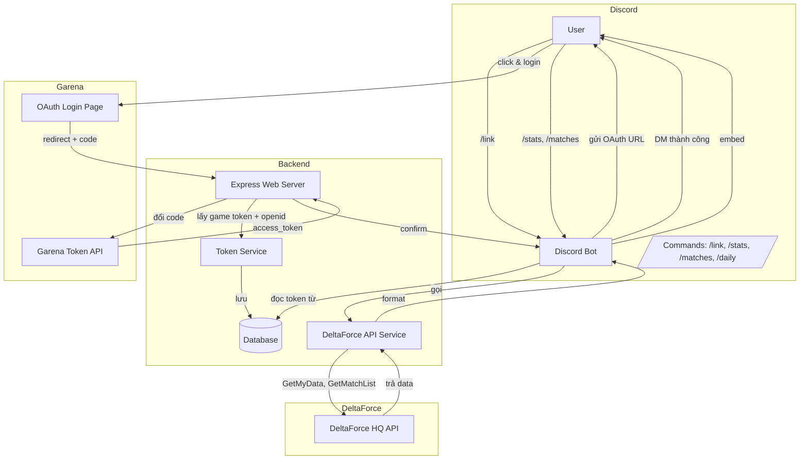
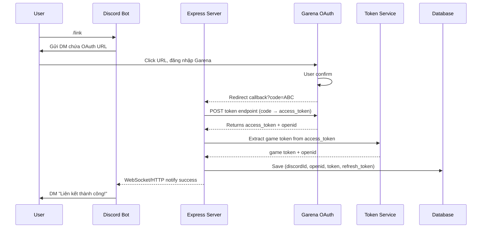
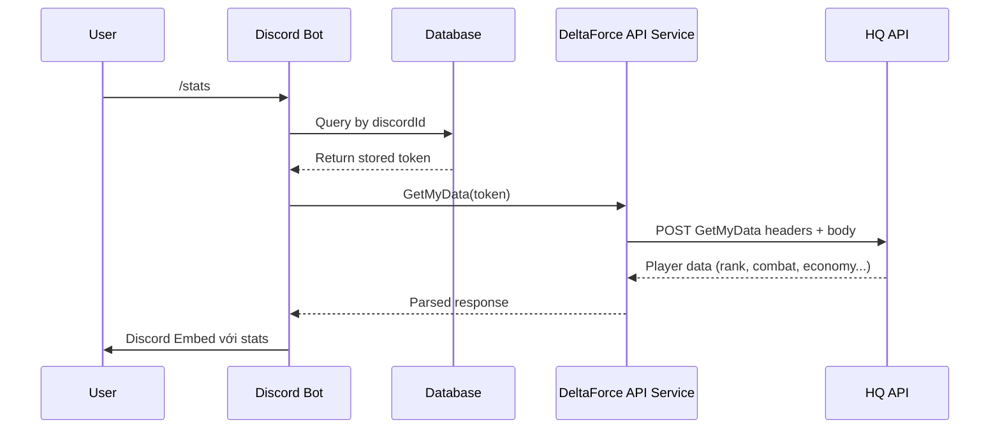
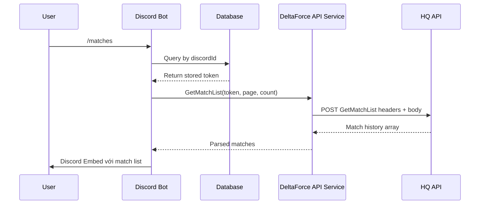
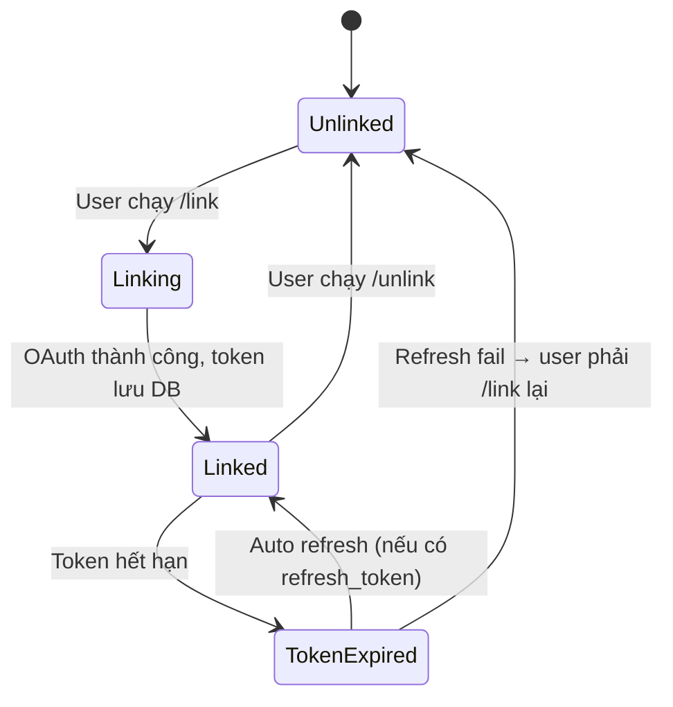

# Mermaid Diagrams - Delta Force HQ Discord Bot

## 1. Tổng quan kiến trúc

## 2. Chi tiết luồng `/link` (OAuth)

## 3. Chi tiết luồng `/stats`

## 4. Chi tiết luồng `/matches`

## 5. Token lifecycle

