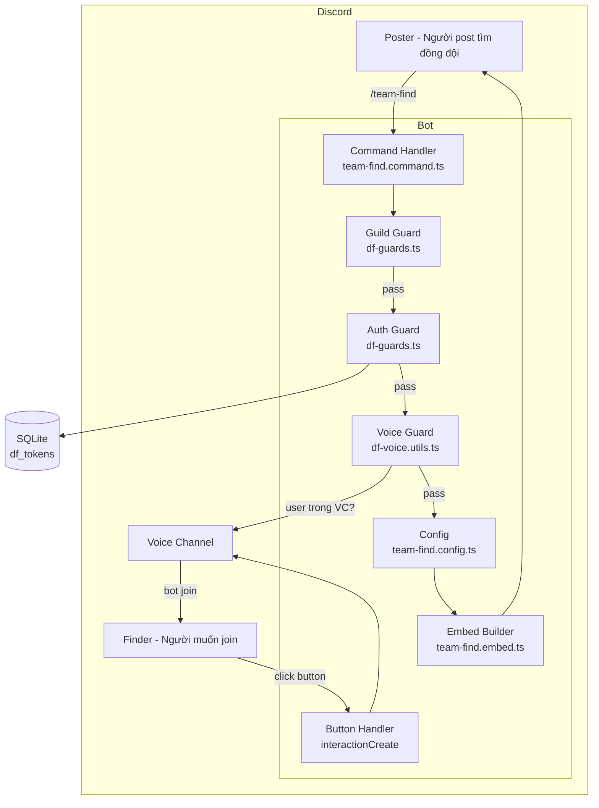
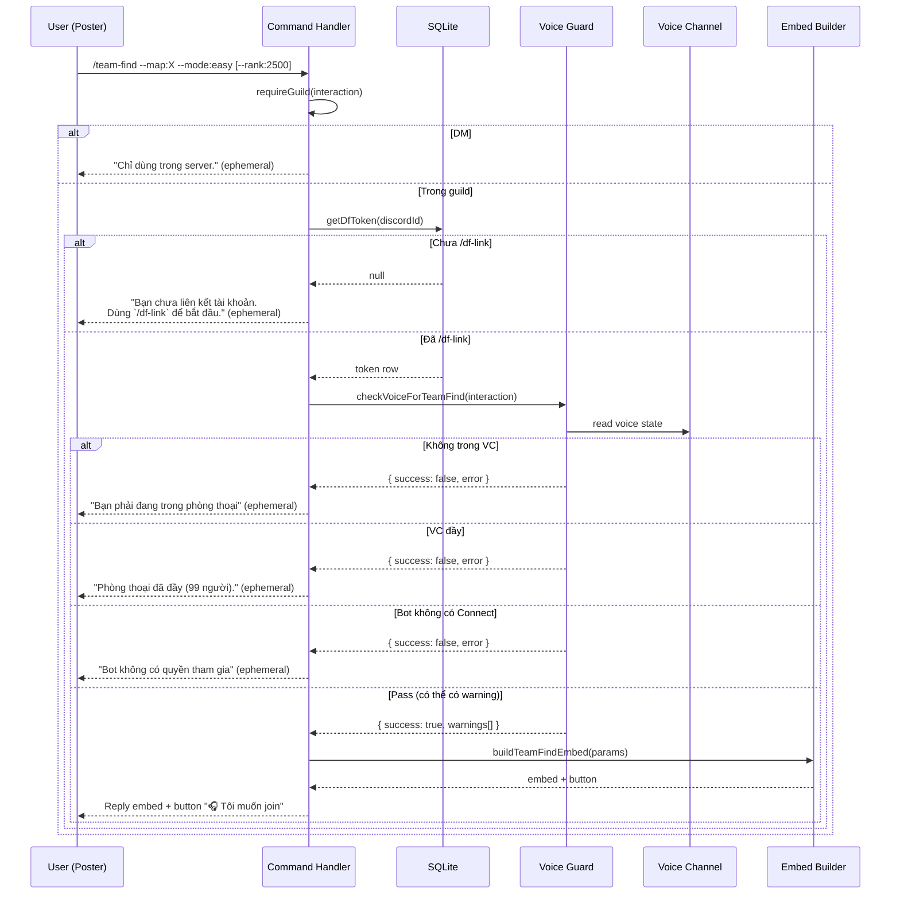
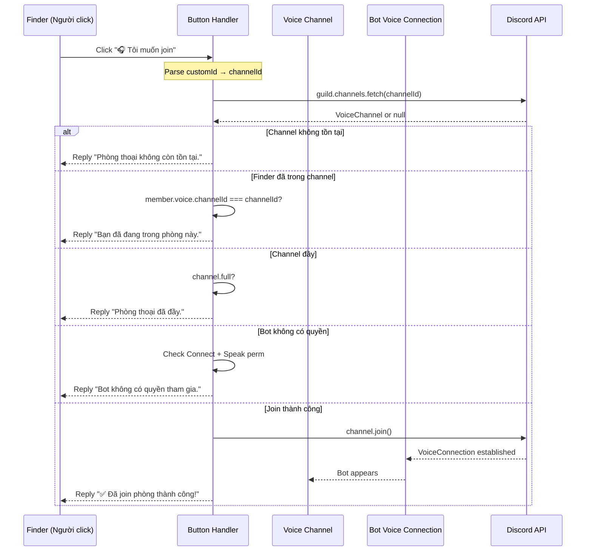
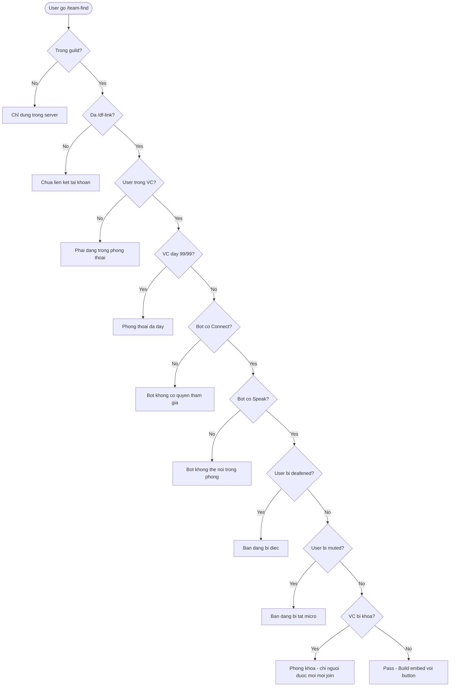
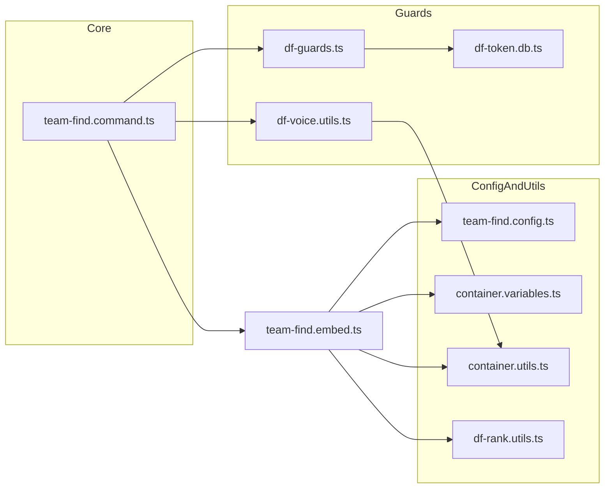

# 6. Tổng quan kiến trúc `/team-find`

## 7. Sequence diagram — Execute `/team-find`

## 8. Sequence diagram — Click button "Tôi muốn join"

## 9. Flowchart — Guard chain (full execute path)

## 10. File dependency graph

